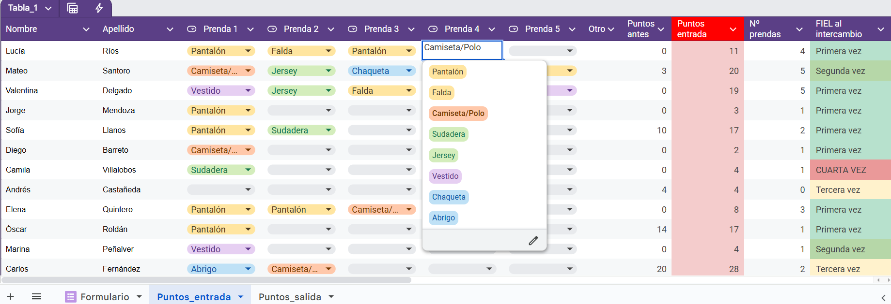
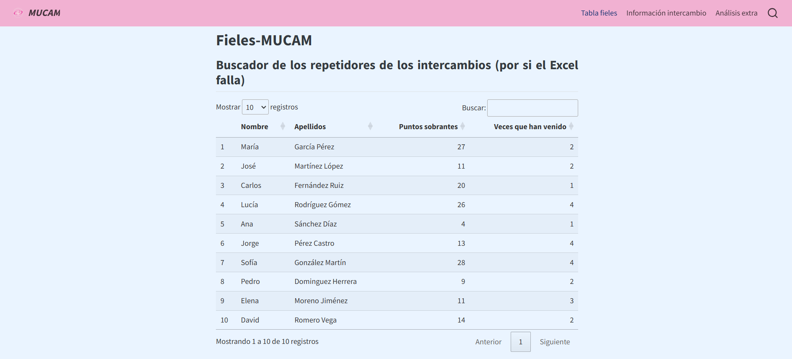

## Proyectos destacados

### 👖 Gestión y análisis de datos de un intercambio de ropa

**Objetivo 1**: mejorar la gestión del sistema de puntuación empleado en el intercambio de ropa de la asociación universitaria MUCAM.

**Objetivo 2**: analizar los datos generados durante el intercambio y realizar un informe a partir de ellos para comprender cómo fue el evento y ver qué elementos se pueden mejorar de cara a futuras ediciones del mismo.

**Herramientas**: R Studio, DataWrapper, GitHub, Google Sheets (incluyendo el uso de Apps Scrips apoyado en la IA).

::: panel-tabset
#### Informe final

```{=html}
<iframe src="analisis_final_2025.html" width="90%" height="400px" style="border:none; margin:1rem 0;"></iframe>
```

#### Sheet

Se trata de una hoja de cálculo interactiva. Al apuntarse una persona en el Formulario, aparecía automáticamente en las dos tablas creadas, donde se buscaba también su nombre para ver si había venido a intercambios anteriores. Las pestañas de prendas, por su parte, permiten simplificar el proceso de apuntar la ropa que trae y se lleva cada persona, ya que solo hay que seleccionar esta entre las opciones disponibles y automáticamente se asignan los puntos correspondientes con ese tipo de prenda.

Asimismo, permitía guardar información extra sobre la hora a la que traían y se llevaba prendas cada persona.



#### Página para la visualización del intercambio

El objetivo de esta página era poder visualizar en tiempo real, gracias a diversos gráficos elaborados con DataWrapper, cómo se iba desarrollando el intercambio. Por ejemplo, se incluía información sobre cuánta gente había venido, cuántos inscritos faltaban por llegar, qué tipos de prendas estaban trayendo/llevándose más y menos...

Asimismo, se incluía una tabla con un buscador para poder localizar fácilmente a aquellas personas que habían participado en intercambios anteriores.


:::

```{=html}
<div class="contact-links">

  <a href="https://github.com/jorgeemm/analisis_datos_intercambio_ropa" class="contact-link">
    <i class="fab fa-github"></i> Ver código en GitHub
  </a>
  
  <a href="analisis_final_2025.html" class="contact-link" target="_blank">
    <i class="fas fa-shirt"></i> Acceder al informe completo
  </a>
  
</div>
```

------------------------------------------------------------------------

### 🎵 Análisis de mis hábitos musicales en Spotify

**Objetivo**: Explorar patrones de escucha, artistas más reproducidos y variaciones estacionales.

**Herramientas**: R Studio, ggplot2, plotly, quarto

```{=html}
<iframe src="Resumen_Spotify.html" width="90%" height="400px" style="border:none; margin:1rem 0;"></iframe>
```

```{=html}
<div class="contact-links">

  <a href="https://github.com/jorgeemm/Resumen_Spotify" class="contact-link">
    <i class="fab fa-github"></i> Ver código en GitHub
  </a>
  
  <a href="Resumen_Spotify.html" class="contact-link">
    <i class="fas fa-music"></i> Acceder al informe completo
  </a>
  
</div>
```

------------------------------------------------------------------------

### 📚 Trabajo de Fin de Grado (TFG)

**Título**: "Brechas en la protesta: influencia de la edad, generación y género a la hora de manifestarse en España"

**Resumen**: Este trabajo explora si la participación en manifestaciones en España es igual para todas las personas con independencia de su género o edad, o si elementos como pertenecer a una determinada generación, o ser hombre o mujer, aumentan las probabilidades de manifestarse.

```{=html}
<iframe src="tfg.pdf" width="80%" height="500px" style="border:none;"></iframe>
```

```{=html}
<div class="contact-links">

  <a href="tfg.pdf" class="contact-link">
    <i class="fas fa-file-pdf"></i> Acceder al TFG completo
  </a>
  
</div>
```

------------------------------------------------------------------------

### 📊 Ejemplos y tutoriales de visualizaciones con R

**Paquetes**: ggplot2

```{=html}
<iframe src="https://jorgemm.quarto.pub/graficos/" width="90%" height="400px" style="border:none;"></iframe>
```


```{=html}
<div class="contact-links">

  <a href="https://jorgemm.quarto.pub/graficos/" class="contact-link">
    <i class="fas fa-chart-column"></i> Página completa
  </a>
  
</div>
```
